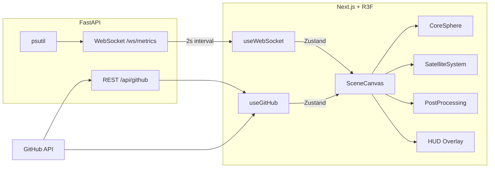

<div align="center">

# 🛰️ Sentinel

**Real-time 3D Monitoring Dashboard with Sci-Fi Aesthetics**

[](https://github.com/souzxxx/sentinel/actions/workflows/ci.yml)
[](https://www.typescriptlang.org/)
[](https://nextjs.org/)
[](https://threejs.org/)
[](https://fastapi.tiangolo.com/)
[](./LICENSE)

*Visualize GitHub repos as orbiting satellites and system metrics in an interactive 3D space*

<!-- Replace with a GIF/screenshot of the dashboard once deployed -->
<!--  -->

</div>

---

## Overview

Sentinel is a full-stack 3D monitoring dashboard inspired by sci-fi interfaces from Iron Man and Minority Report. It transforms real data — GitHub repositories and system metrics — into an interactive orbital visualization.

Each of your GitHub repos becomes a **satellite** orbiting a central core, with properties mapped to real data:
- **Size** → stars + forks
- **Color** → primary language
- **Orbit speed** → push recency
- **Distance** → repo age

The **central core** pulses with system CPU load, changing color from green → yellow → red as load increases. Custom GLSL shaders create plasma effects, holographic grids, and glitch overlays when metrics go critical.

## Features

- **3D Orbital Visualization** — GitHub repos as orbiting satellites with real-time data mapping
- **Real-time Metrics** — WebSocket streaming of CPU, RAM, disk, and network stats
- **Reactive Core** — Central sphere changes color and pulse intensity based on CPU load
- **Interactive Selection** — Click satellites for GSAP-powered camera fly-to + detail panel
- **Post-Processing** — Bloom, vignette, chromatic aberration, ACES filmic tone mapping
- **Custom GLSL Shaders** — Plasma core, holographic grid, critical-state glitch overlay
- **Particle Systems** — Space dust, heat particles rising from core under load
- **HUD Overlay** — Sci-fi clock, status indicators, connection state
- **Keyboard Navigation** — Tab/arrows to cycle, Enter to focus, Esc to return
- **Auto-Reconnect** — Graceful WebSocket reconnection with status feedback

## Tech Stack

### Frontend
| Technology | Purpose |
|---|---|
| Next.js 16 (App Router) | Framework, SSR, routing |
| React Three Fiber | Three.js as React components |
| @react-three/drei | 3D helpers (OrbitControls, Text, Stars) |
| @react-three/postprocessing | Bloom, vignette, chromatic aberration |
| Zustand | Global state management |
| GSAP | Camera fly-to animations |
| Framer Motion | UI panel animations |
| Tailwind CSS | HUD and panel styling |
| TypeScript | Full type safety |

### Backend
| Technology | Purpose |
|---|---|
| FastAPI | REST API + WebSocket server |
| psutil | System metrics (CPU, RAM, disk, network) |
| httpx | Async GitHub API client |
| Docker | Containerized deployment |

### CI/CD
| Technology | Purpose |
|---|---|
| GitHub Actions | Lint, test, build on every push |
| Vercel | Frontend auto-deploy |
| Render | Backend deploy (Docker) |

## Architecture



## Getting Started

### Prerequisites
- Node.js 20+
- Python 3.12+

### Frontend

```bash
cd apps/web
npm install
npm run dev        # → http://localhost:3000
```

### Backend

```bash
cd apps/api
python -m venv venv
source venv/bin/activate   # Windows: venv\Scripts\activate
pip install -r requirements.txt
uvicorn app.main:app --reload  # → http://localhost:8000
```

### Environment Variables

```bash
# apps/web/.env.local (optional)
NEXT_PUBLIC_WS_URL=ws://localhost:8000/ws/metrics
NEXT_PUBLIC_GITHUB_TOKEN=ghp_your_token

# apps/api/.env (optional)
GITHUB_TOKEN=ghp_your_token
GITHUB_USERNAME=souzxxx
CORS_ORIGINS=http://localhost:3000
```

### Running Tests

```bash
# Frontend
cd apps/web && npm test

# Backend
cd apps/api && source venv/bin/activate && pytest tests/ -v
```

## Project Structure

```
sentinel/
├── apps/
│   ├── web/                    # Next.js frontend
│   │   └── src/
│   │       ├── components/
│   │       │   ├── canvas/     # R3F 3D components (*.three.tsx)
│   │       │   ├── hud/        # Overlay UI (clock, status)
│   │       │   └── ui/         # React + Tailwind (panels)
│   │       ├── hooks/          # useGitHub, useWebSocket, useKeyboardNav
│   │       ├── stores/         # Zustand (scene, github, metrics)
│   │       ├── lib/            # Theme constants, GitHub service
│   │       └── types/          # TypeScript definitions
│   └── api/                    # FastAPI backend
│       ├── app/
│       │   ├── api/routes/     # REST endpoints
│       │   ├── api/ws/         # WebSocket handlers
│       │   ├── services/       # Business logic
│       │   └── core/           # Config
│       └── Dockerfile
├── .github/workflows/ci.yml    # CI pipeline
└── README.md
```

## Roadmap

- [x] Phase 1 — Core Scene (pulsing sphere, orbital ring, stars, camera)
- [x] Phase 2 — GitHub Satellites (API, orbits, labels, connections)
- [x] Phase 3 — Interaction (raycasting, fly-to, detail panel, HUD, keyboard nav)
- [x] Phase 4 — Backend (FastAPI, WebSockets, real-time metrics)
- [x] Phase 5 — Visual Polish (bloom, particles, GLSL shaders, glitch effects)
- [x] Phase 6 — Deploy & Showcase (CI/CD, README, meta tags, loading screen)

## License

[MIT](./LICENSE) — Leonardo de Souza Lima e Silva
